# P3 - Seguridad de Redes | Infraestructura 2


Implementación de una infraestructura segmentada con **FortiGate**, una red de usuarios, un **Jump Server**, un **Web Server** aislado y una **VPN IPsec de acceso remoto**.  
El diseño obliga al usuario remoto a entrar primero por **JUMP01** y evita el acceso directo desde la VPN o la red de usuarios hacia **WEB-CAJA**.

---

## Objetivos

- Segmentar usuarios, Jump Server y Web Server en redes independientes.
- Permitir administración controlada de **WEB-CAJA** únicamente desde **JUMP01**.
- Bloquear el acceso directo de usuarios hacia **WEB-CAJA**.
- Implementar acceso remoto mediante **IPsec Remote Access VPN**.
- Aplicar **split tunneling** para anunciar únicamente el host JUMP01.
- Permitir por la VPN únicamente **RDP/3389 hacia JUMP01**.
- Registrar tráfico permitido y denegado en FortiGate.
- Validar técnicamente el aislamiento mediante pruebas reales.

---

## Arquitectura

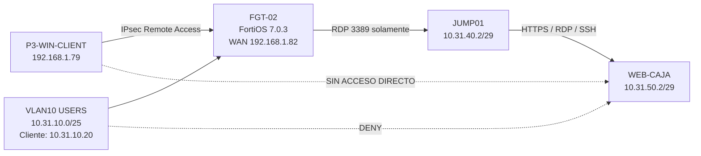

### Flujo de seguridad

```text
Internet / red externa
        |
        | IPsec
        v
     FGT-02
        |
        | RDP/3389
        v
     JUMP01
        |
        | HTTPS / RDP / SSH
        v
    WEB-CAJA
```

---

## Plan de direccionamiento

| Segmento | Red | Gateway / interfaz FortiGate | Host principal |
|---|---|---|---|
| Usuarios | `10.31.10.0/25` | `10.31.10.1` | Cliente DHCP `10.31.10.20` |
| JUMP-LAN | `10.31.40.0/29` | `10.31.40.1` / port3 | JUMP01 `10.31.40.2` |
| WEB-LAN | `10.31.50.0/29` | `10.31.50.1` / port4 | WEB-CAJA `10.31.50.2` |
| Pool VPN IPsec | `10.31.60.0/24` | Mode Config | `10.31.60.10-10.31.60.20` |
| WAN / Management | `192.168.1.0/24` | port1 | FGT-02 `192.168.1.82` |

---

## Componentes

### FGT-02
- FortiOS VM64-KVM **v7.0.3 build 0237**.
- Firewall en modo NAT.
- Segmentación entre USERS, JUMP-LAN y WEB-LAN.
- Objetos de dirección para JUMP01 y WEB-CAJA.
- Políticas con logging habilitado.
- VPN IPsec Remote Access generada mediante el wizard de FortiGate.

### JUMP01
- Windows Server.
- IP: `10.31.40.2/29`.
- Gateway: `10.31.40.1`.
- Punto intermedio obligatorio para administración del servidor WEB-CAJA.
- RDP habilitado para la prueba de acceso remoto.

### WEB-CAJA
- Windows Server.
- IP: `10.31.50.2/29`.
- Gateway: `10.31.50.1`.
- Servicios validados desde JUMP01:
  - HTTPS/443
  - RDP/3389
  - SSH/22

### P3-WIN-CLIENT
- Cliente Windows utilizado para pruebas locales y remotas.
- IP externa: `192.168.1.79`.
- IP recibida por VPN: `10.31.60.10`.
- La NIC interna se deshabilitó durante la prueba VPN para evitar rutas alternativas.

---

## Políticas principales

| Política | Origen | Destino | Servicios | Acción | NAT |
|---|---|---|---|---|---|
| `JUMP-TO-WEB` | HOST-JUMP01 | HOST-WEB-CAJA | HTTPS, RDP, SSH | ACCEPT | Disabled |
| `USERS-DENY-WEB` | NET-USERS-INFRA2 | HOST-WEB-CAJA | ALL | DENY | N/A |
| `vpn_INFRA2-IPSEC_remote_0` | INFRA2-IPSEC_range | HOST-JUMP01 | RDP | ACCEPT | Disabled |

La política de VPN se limita a **JUMP01**, por lo que WEB-CAJA no es anunciado como destino del túnel.

---

## VPN IPsec Remote Access

Configuración final utilizada:

| Parámetro | Valor |
|---|---|
| Tipo | Remote Access / Client-based / FortiClient |
| Interfaz de entrada | WAN-MGMT (port1) |
| Autenticación | Pre-shared Key + XAuth |
| Grupo | `SSLVPN-USERS` |
| IKE | IKEv1 |
| Mode | Aggressive |
| Address Assignment | Mode Config |
| Pool | `10.31.60.10 - 10.31.60.20` |
| Split tunnel | Solo `HOST-JUMP01 (10.31.40.2/32)` |
| Acceso permitido | RDP/3389 hacia JUMP01 |

> La PSK y las contraseñas se omiten deliberadamente del repositorio.

### Evidencia de creación

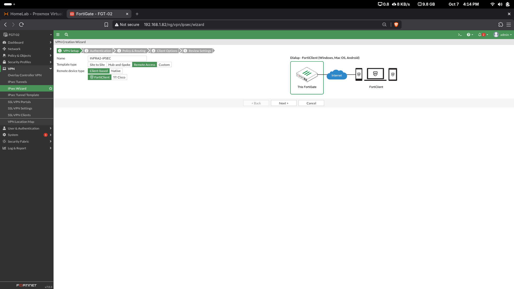

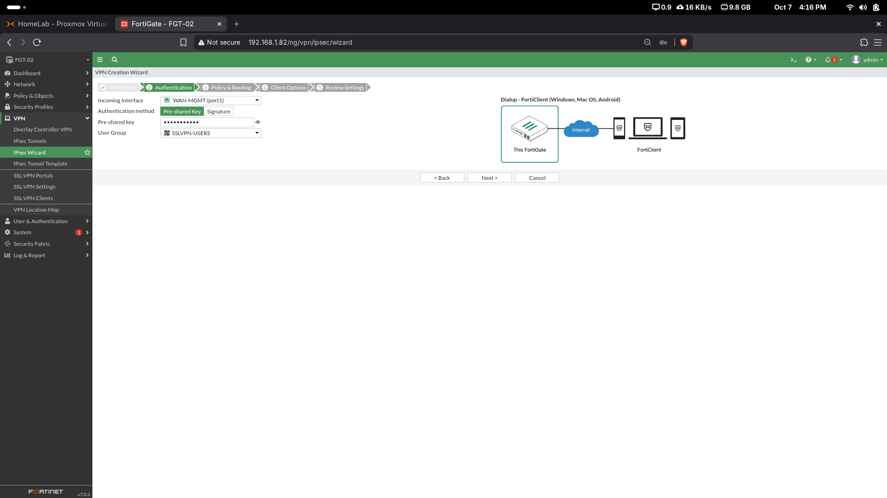

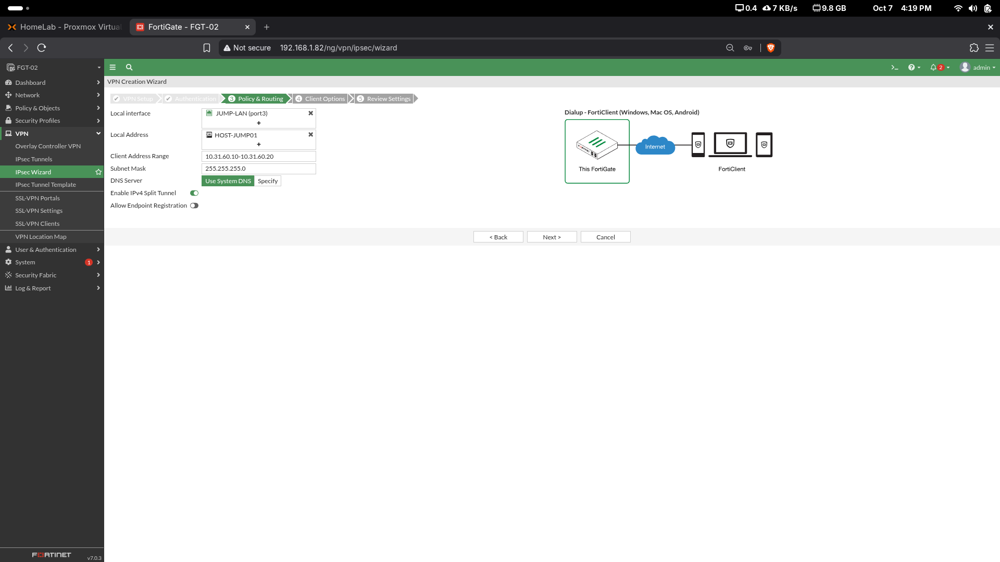

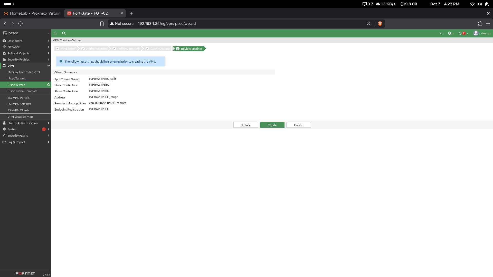

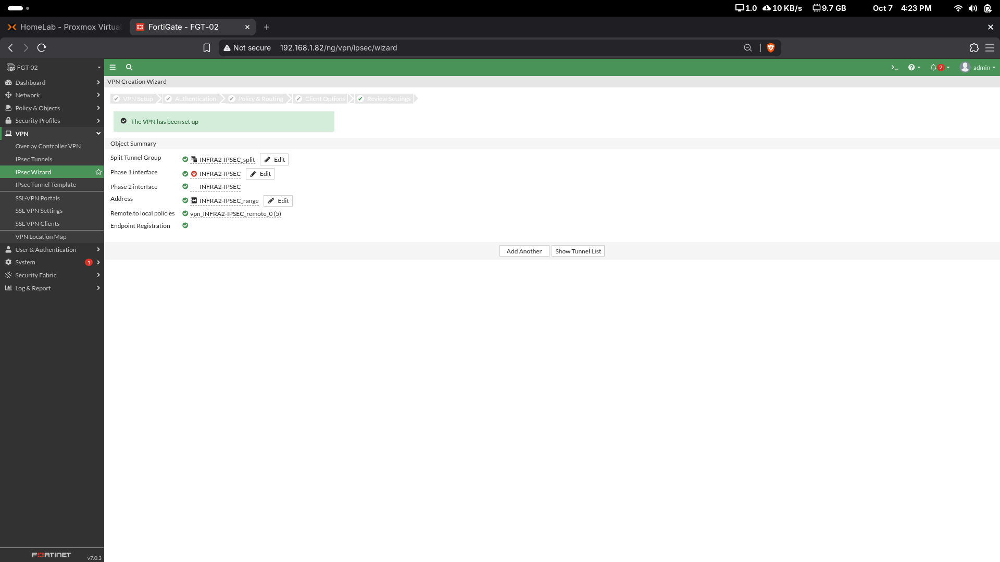

---

## Validaciones

### 1. Usuarios no pueden entrar directamente a WEB-CAJA

Desde `10.31.10.20` se validó que RDP y HTTPS hacia `10.31.50.2` son bloqueados.

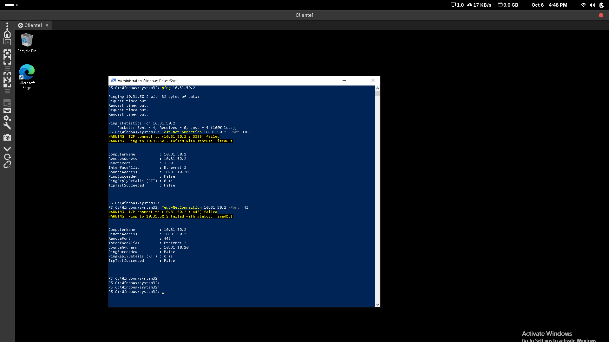

El FortiGate registra el bloqueo mediante la política `USERS-DENY-WEB`.

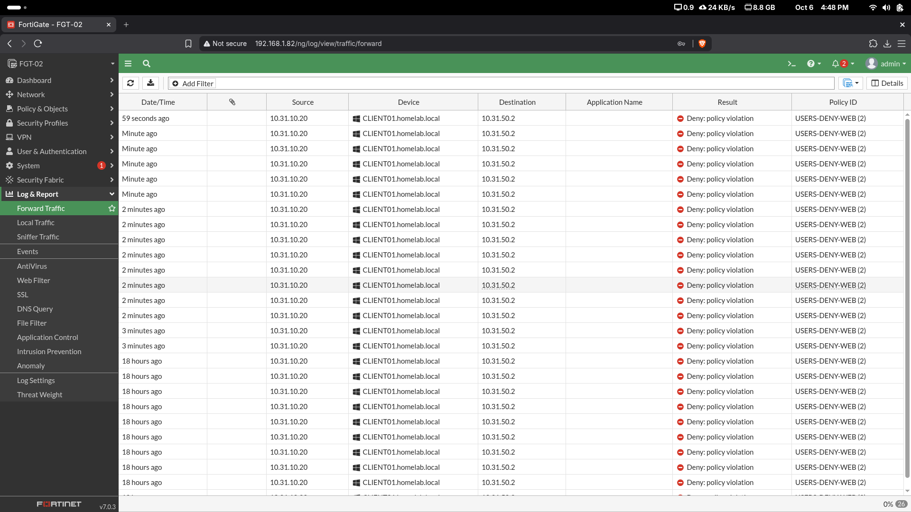

### 2. JUMP01 sí puede acceder a WEB-CAJA

Los logs muestran tráfico desde `10.31.40.2` hacia `10.31.50.2` asociado a `JUMP-TO-WEB`.

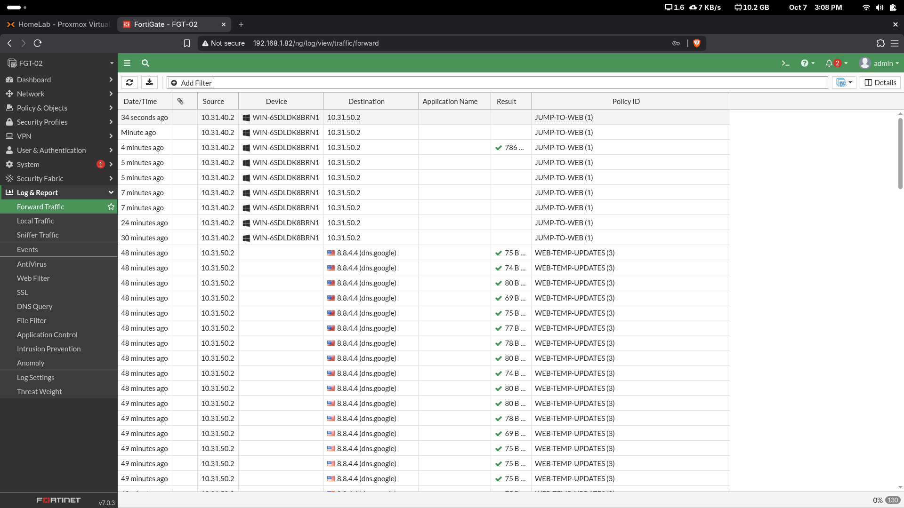

La siguiente captura muestra en una misma vista tráfico permitido desde JUMP01 y tráfico denegado desde USERS.

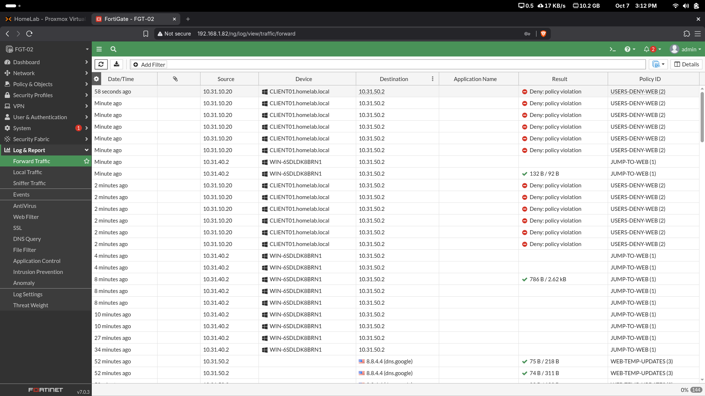

### 3. Política IPsec limitada a JUMP01

La política generada para el túnel permite únicamente RDP desde el rango IPsec hacia `HOST-JUMP01`, con NAT deshabilitado y logging de todas las sesiones.

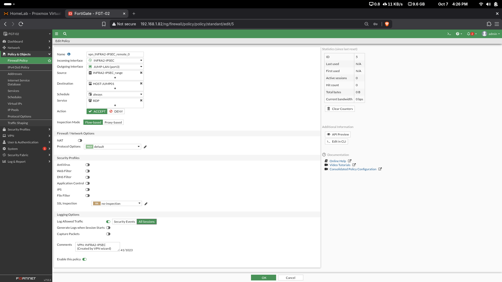

### 4. VPN no puede entrar directamente a WEB-CAJA

Con el túnel activo, las pruebas directas hacia `10.31.50.2` por RDP/3389, HTTPS/443 y SSH/22 resultan bloqueadas.

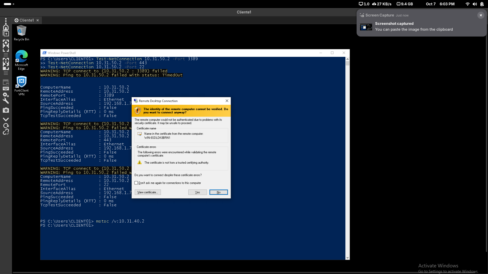

### 5. VPN sí llega a JUMP01 por RDP

El cliente IPsec recibió `10.31.60.10`, instaló la ruta específica hacia `10.31.40.2/32` y permitió una sesión RDP real a JUMP01.

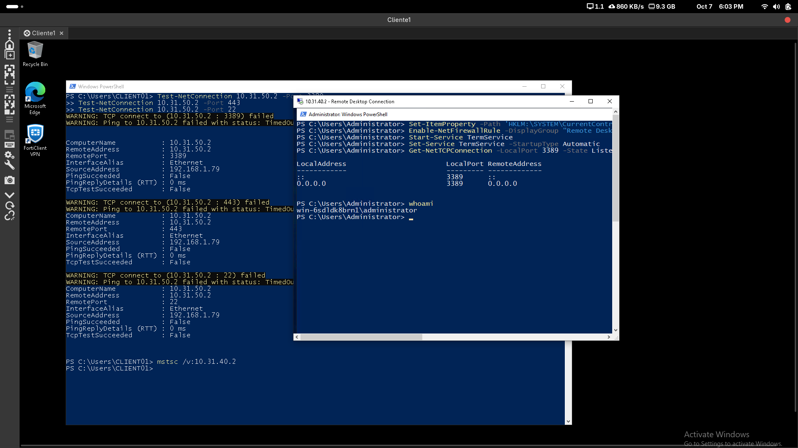

---

## Resultado final

| Prueba | Resultado |
|---|---|
| VLAN10 → WEB-CAJA RDP | Bloqueado ✅ |
| VLAN10 → WEB-CAJA HTTPS | Bloqueado ✅ |
| JUMP01 → WEB-CAJA | Permitido ✅ |
| VPN IPsec establecida | Correcto ✅ |
| Cliente VPN recibe `10.31.60.10` | Correcto ✅ |
| Split tunnel anuncia solo JUMP01 | Correcto ✅ |
| VPN → JUMP01 RDP | Permitido ✅ |
| VPN → WEB-CAJA directo | Bloqueado ✅ |
| Logging de tráfico | Validado ✅ |

---

## Estructura del repositorio

```text
.
├── README.md
├── configs/
│   ├── FGT-02-IPSEC-sanitized.conf
│   └── FortiClient-IPsec-profile.txt
├── diagrams/
│   └── topology.md
├── docs/
│   ├── ADDRESSING.md
│   ├── TROUBLESHOOTING.md
│   ├── VALIDATION.md
│   └── VIDEO-GUIDE.md
└── screenshots/
    ├── fortigate/
    ├── tests/
    ├── troubleshooting/
    └── vpn/
```

---

## Documentación adicional

- [Plan de direccionamiento](docs/ADDRESSING.md)
- [Pruebas y validación](docs/VALIDATION.md)
- [Troubleshooting y limitaciones del entorno EVAL](docs/TROUBLESHOOTING.md)
- [Guía para grabar el video](docs/VIDEO-GUIDE.md)
- [Configuración sanitizada de FGT-02](configs/FGT-02-IPSEC-sanitized.conf)
- [Perfil de FortiClient](configs/FortiClient-IPsec-profile.txt)

---

## Nota sobre SSL-VPN

Durante el laboratorio se intentó inicialmente SSL-VPN. En el entorno EVAL utilizado se presentó una incompatibilidad de negociación TLS/cifrados con el cliente moderno. Para cumplir el objetivo de acceso remoto se implementó finalmente **IPsec Remote Access**, quedando este como el diseño final validado.

Las capturas del intento SSL-VPN se conservan únicamente como evidencia de troubleshooting en `screenshots/troubleshooting/`.

---

## Video

Video de demostración de la Infraestructura 2:

https://youtu.be/9j7XP9V15-M

El video debe mostrar de forma resumida:

1. Topología.
2. Interfaces y redes.
3. Políticas principales.
4. Bloqueo USERS → WEB-CAJA.
5. Acceso JUMP01 → WEB-CAJA.
6. Conexión IPsec.
7. IP `10.31.60.10` y ruta `10.31.40.2/32`.
8. RDP VPN → JUMP01.
9. Bloqueo VPN → WEB-CAJA.
10. Logs finales.

---

## Seguridad

Este repositorio **no publica**:

- Pre-shared keys.
- Contraseñas.
- Secretos cifrados de FortiGate.
- Credenciales administrativas.

Las configuraciones incluidas son versiones sanitizadas destinadas exclusivamente a documentación académica.
