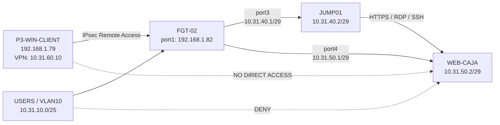

# Topología - Infraestructura 2



## Principio de diseño

El acceso administrativo remoto sigue el recorrido:

```text
P3-WIN-CLIENT -> IPsec -> FGT-02 -> JUMP01 -> WEB-CAJA
```

No existe un flujo autorizado directo:

```text
P3-WIN-CLIENT -> WEB-CAJA
```

ni:

```text
VLAN10-USERS -> WEB-CAJA
```
